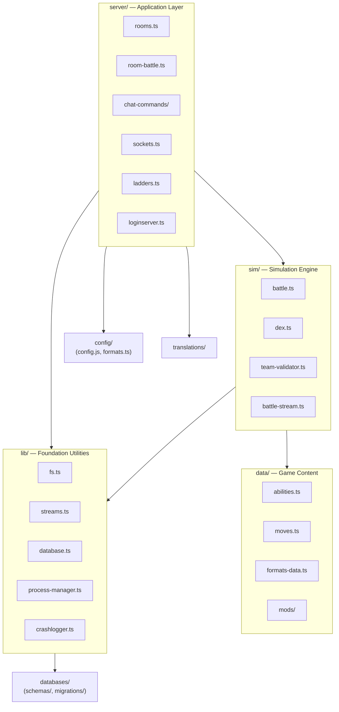
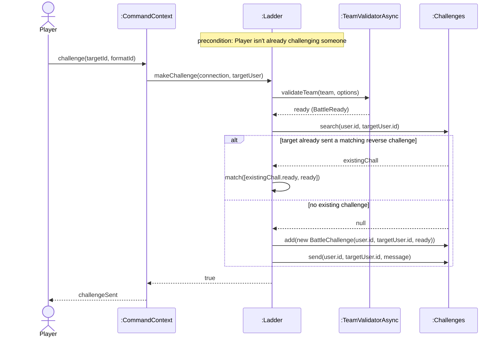
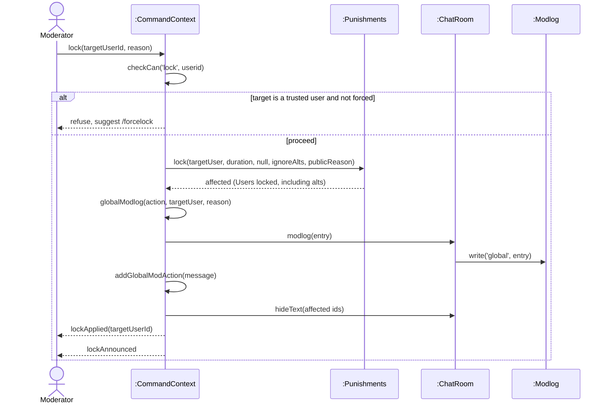

# Logical Architecture and Interaction Diagrams

**Project:** Pokémon Showdown (server repository, `smogon/pokemon-showdown`)
**Course:** CSCI 360 — Software Architecture, Security, and Testing

---

## Part 1: Identify the Architectural Style

Pokémon Showdown is best described as a hybrid of **client-server** and **pipe-and-filter**, not event-driven. The client-server relationship is genuinely three-tiered: the client (a separate repository, out of scope here) connects to the game server over WebSockets, handled by `server/sockets.ts` (`sockjs.createServer(...)`, `server.on('connection', ...)`), and the game server in turn acts as a client to an external login server over plain HTTP, seen in `server/loginserver.ts:132` (`Net(\`${this.uri}action.php\`)`). Internally, the simulator (`sim/`) is connected to the rest of the server through a pipe-and-filter boundary rather than direct method calls: `sim/` runs in its own worker processes, spawned and managed by `lib/process-manager.ts`, and communicates only through a linear, newline-delimited text protocol documented in `sim/SIM-PROTOCOL.md` and implemented by `sim/battle-stream.ts` and `server/room-battle.ts`'s `RoomBattleStream`. The battle engine's action-queue dispatch (`Battle.runEvent()`, `sim/battle.ts:758`) looks at first like event-driven architecture, but it's actually a synchronous Observer-pattern dispatch operating inside a single `Battle` object, not a publish/subscribe mechanism connecting independent system components — there is no `EventEmitter`-based pub/sub anywhere in `server/` or `lib/`, which is the evidence that would be expected if event-driven communication were organizing the system at the architectural level.

---

## Part 2: Logical Architecture Diagram

Dependency direction was verified by grepping actual import statements across every top-level directory, in both directions, before drawing an arrow. Every arrow below is one-directional; the reverse import was checked and does not exist (server/ never gets imported by sim/, lib/, or data/; lib/ never imports sim/, server/, or data/; data/ never imports sim/ or lib/).

Source: [docs/logical-architecture.mmd](logical-architecture.mmd)



---

## Part 3: Two Interaction Diagrams

### Diagram 1 — expands SSD 2 (`challenge(targetId, formatId)`)

Traces `server/chat-commands/core.ts:1516` → `server/ladders.ts:151` (`Ladder.makeChallenge`). Every participant is a real class: `CommandContext` (`server/chat.ts:589`), `Ladder` (`server/ladders.ts:35`), `TeamValidatorAsync` (`server/team-validator-async.ts:46`), `Challenges` (`server/ladders-challenges.ts:107`). `BattleReady`/`BattleChallenge` are shown as inline constructor calls rather than separate lifelines, since they're value objects created and handed off in the same line of real code (`server/ladders.ts:211`).

Source: [docs/interaction-challenge-player.mmd](interaction-challenge-player.mmd)



### Diagram 2 — expands SSD 3 (`lock(targetUserId, reason)`)

Traces `server/chat-commands/moderation.ts:866` (`lock`) through the real punishment and modlog write path. Every participant is a real class: `CommandContext` (`server/chat.ts:589`), `Punishments` (`server/punishments.ts:211`), `ChatRoom` (`server/rooms.ts:1905`), `Modlog` (`server/modlog/index.ts:97`).

Source: [docs/interaction-lock-user.mmd](interaction-lock-user.mmd)



---

## Part 4: One Architectural Concern

**Files involved:** `server/rooms.ts` and `server/room-battle.ts`

`server/rooms.ts:37` imports `RoomBattle` — along with `RoomBattlePlayer`, `RoomBattleTimer`, and `RoomBattleOptions` — directly from `./room-battle`, and uses it at runtime: `Rooms.createBattle()` (`server/rooms.ts:2191`) does `new RoomBattle(room, options)` (`server/rooms.ts:2272`). In the other direction, `server/room-battle.ts:20` has `import type { RoomSettings } from './rooms';`. The two files that define "what a room is" and "what a battle-room is" mutually reference each other's exports — `room-battle.ts` needs `Room`'s settings shape to type its own options, and `rooms.ts` needs the `RoomBattle` class to construct one. The reverse import is `type`-only, so TypeScript erases it at compile time and there's no runtime require-cycle crash, but conceptually neither file sits below the other in the layering — exactly what the assignment means by a circular dependency.

**Cost:** Neither file can be fully understood, changed, or unit-tested in isolation — a change to `RoomSettings` in `rooms.ts` can force a matching change to `room-battle.ts`'s option types, and a change to `RoomBattle`'s constructor signature ripples back into `rooms.ts`'s `createBattle()`. It also leaves the intended layering ambiguous to a new contributor: nothing in the file structure signals whether `Room` is the more fundamental abstraction that `RoomBattle` extends, or whether the two are peers that happen to need each other — that only becomes visible by reading both files' imports side by side, which is exactly how this was found.

---

## Part 5: GRASP in Your Project

### Applied well #1 — Information Expert: `Battle.getTarget()` asks `Dex` for move data

`Battle` (`sim/battle.ts`) needs the full `Move` object — its target type, flags, and so on — to resolve who a move can hit, but `Battle` doesn't store move definitions itself. `Dex` is the class that actually holds move data (loaded from `data/moves.ts`), so `Battle` asks `Dex` for it rather than duplicating or caching the data locally. This keeps move data in exactly one place: whichever class needs move info goes through the same expert instead of maintaining its own copy that could drift out of sync.

```ts
// sim/battle.ts:2437-2438
getTarget(pokemon: Pokemon, move: string | Move, targetLoc: number, originalTarget?: Pokemon) {
    move = this.dex.moves.get(move);
    let tracksTarget = move.tracksTarget;
    // ...
}
```

### Applied well #2 — Pure Fabrication: `TeamValidator`

There is no real-world domain concept called a "team validator" — a player describing the game would never name one. It exists purely so the responsibility of checking whether a team is legal for a format doesn't get bolted onto `Team`, `Pokemon`, or `Battle`, none of which need validation rules to do their own jobs. That's a textbook Pure Fabrication: a class invented specifically for high cohesion and low coupling, not because it models something in the problem domain.

```ts
// sim/team-validator.ts:334-354
export class TeamValidator {
    readonly format: Format;
    readonly dex: ModdedDex;
    readonly gen: number;
    readonly ruleTable: RuleTable;
    readonly minSourceGen: number;
    readonly toID: (str: any) => ID;

    constructor(format: string | Format, dex = Dex) {
        this.format = dex.formats.get(format);
        // ...
        this.dex = dex.forFormat(this.format);
        this.gen = this.dex.gen;
        this.ruleTable = this.dex.formats.getRuleTable(this.format);
    }

    validateTeam(team: PokemonSet[] | null, options: { /* ... */ }) { /* ... */ }
}
```

### Violation — High Cohesion: `Battle.checkMoveMakesContact()`

This single method both answers a pure simulation question ("does this move make contact, accounting for Protective Pads?") and directly emits wire-protocol output as a side effect of answering it. Cohesion is violated because the method — and, more broadly, `Battle` as a whole (this same mixing recurs at `sim/battle.ts:193,293,362,578-587` and hundreds of other call sites) — is responsible for both game-rules logic and client-facing message formatting, two responsibilities that change for entirely different reasons: a balance patch touches the same code as a protocol/display change.

**Consequence:** testing "does this move correctly bypass Protective Pads" can't be isolated from testing "does the right protocol line get emitted," since both happen inside the same function call. Because this pattern repeats throughout `sim/battle.ts` rather than being kept behind a single serialization boundary, a change meant only to affect wire-protocol formatting carries real risk of touching simulation logic by accident, and vice versa.

```ts
// sim/battle.ts:1289-1298
checkMoveMakesContact(move: ActiveMove, attacker: Pokemon, defender: Pokemon, announcePads = false) {
    if (move.flags['contact'] && attacker.hasItem('protectivepads')) {
        if (announcePads) {
            this.add('-activate', defender, this.effect.fullname);
            this.add('-activate', attacker, 'item: Protective Pads');
        }
        return false;
    }
    return !!move.flags['contact'];
}
```

---

## Part 6: Present in Class

Not something I can do for you — this is a live, ninety-second walkthrough. Best pairing for the time limit: put the **Part 2 architecture diagram** on screen first (name the style in one sentence — "client-server plus pipe-and-filter"), then show **Diagram 1** (the condensed `challenge()` interaction) since it's the tighter of the two, and close with the **Part 4 circular-dependency finding**, which is a two-file, two-line citation that's fast to say out loud. Open the wiki page before class starts.
