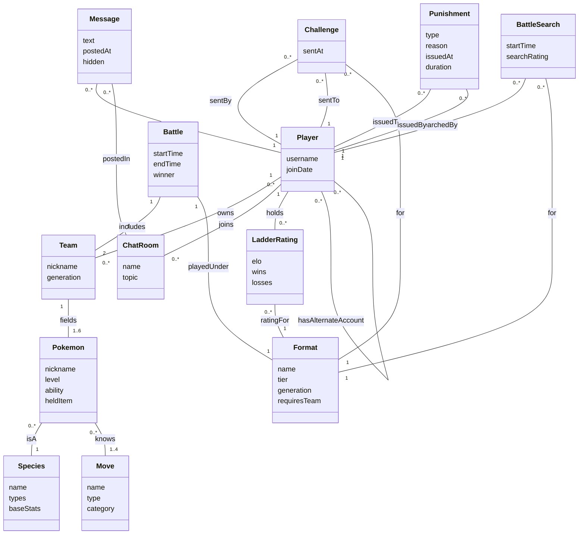
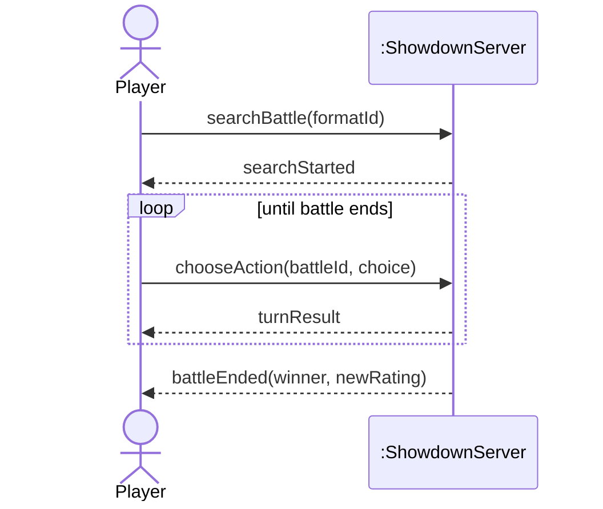
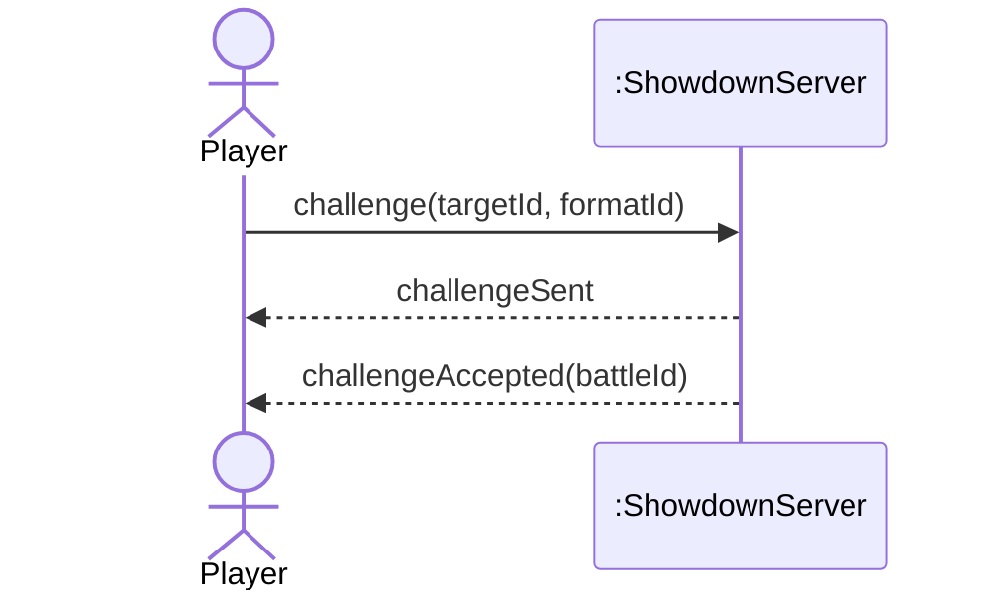
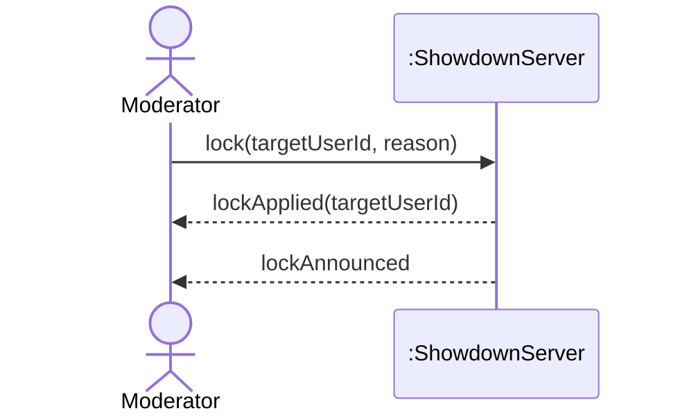

# Domain Model, SSDs, and Operation Contracts

**Project:** Pokémon Showdown (server repository, `smogon/pokemon-showdown`)
**Course:** CSCI 360 — Software Architecture, Security, and Testing

This builds directly on the three fully-dressed use cases from the Requirements and Use Cases assignment: **Play a Ranked Ladder Battle**, **Challenge a Specific Player to a Battle**, and **Lock a Rule-Breaking User**.

---

## Part 1: Tighten the Domain Model

### Noun Phrase Analysis

| Noun phrase | Found in | Decision | Why |
|---|---|---|---|
| Player | Play a Ranked Ladder Battle, step 1 | Conceptual class (already modeled) | A real person with an identity who owns Teams and holds ratings |
| Format | Play a Ranked Ladder Battle, step 1 | Conceptual class (already modeled) | A named tier/ruleset that exists independently of any one battle |
| rank requirement | Play a Ranked Ladder Battle, step 2 | Neither | A server-wide configuration threshold (`Config.laddermodchat`), not a stable property of any domain class |
| matchmaker | Play a Ranked Ladder Battle, step 2 | Neither | Names an algorithm/behavior, not a real-world thing — same category as Manager/Service/Handler |
| Team | Play a Ranked Ladder Battle, step 3 | Conceptual class (already modeled) | A real, ownable collection of Pokémon |
| rating / Elo rating | Play a Ranked Ladder Battle, steps 3, 11 | Attribute of LadderRating (already modeled) | Just a number describing standing in a format |
| search record | Play a Ranked Ladder Battle, step 4 | **New conceptual class: BattleSearch** | Has its own identity and lifecycle (created, matched, canceled) distinct from the Player who made it |
| battle room | Play a Ranked Ladder Battle, step 6 | Neither | The same real-world thing as Battle, not a separate concept — a room only exists because a Battle is happening in it |
| simulator process | Play a Ranked Ladder Battle, step 6 | Neither | An implementation detail (a Node.js worker process), not something a domain expert would name |
| choice (move/switch) | Play a Ranked Ladder Battle, step 8 | Neither | A transient instruction sent each turn; not persisted as its own object in this model |
| challenge | Challenge a Specific Player to a Battle, step 1 | **New conceptual class: Challenge** | A real invitation that exists on its own — it can be sent, sit pending, and be accepted, independent of either Player |
| target Player / Challenger | Challenge a Specific Player to a Battle, step 1 | Neither | Role names for Player, not new classes |
| ready-to-battle record | Challenge a Specific Player to a Battle, step 3 | Neither | An internal validation checkpoint (software artifact), not a domain concept |
| Moderator | Lock a Rule-Breaking User, step 1 | Neither | A role a Player plays by holding a permission level, not a separate class |
| reason | Lock a Rule-Breaking User, step 1 | Attribute of Punishment | Just text describing why a punishment was issued |
| punishment record | Lock a Rule-Breaking User, step 2 | **New conceptual class: Punishment** | A real, persistent thing with its own type, reason, and timestamp, generalized beyond just "lock" (the real project also has bans and mutes) |
| alternate accounts | Lock a Rule-Breaking User, step 4 | Neither | Indicates a relationship between two Player instances, not a new class — modeled as a self-association on Player |
| modlog entry | Lock a Rule-Breaking User, step 5 | Neither | The same record as Punishment, not a second concept |
| room | Lock a Rule-Breaking User, step 6 | Neither | Already covered by the existing ChatRoom class |
| messages | Lock a Rule-Breaking User, step 7 | **New conceptual class: Message** | A real thing with an author, a room, and a visibility state that can be hidden — not previously in the model |
| appeal | Lock a Rule-Breaking User, step 8 | Neither | Only offered in this use case's main scenario, never acted on — out of scope until a use case exercises it |

### What Changed and Why

The Build Demo model had nine classes built around battle mechanics alone (Player, Team, Pokémon, Species, Move, Format, Battle, ChatRoom, LadderRating) because it was drawn before any use cases existed to check it against. Running the three fully-dressed use cases through noun-phrase analysis surfaced four real domain concepts that battle mechanics never touch: a **Challenge** (an invitation that exists and persists independently of the battle it may produce), a **BattleSearch** (a ladder queue entry with its own start time and lifecycle), a **Punishment** (generalized from "lock" because the same domain concept covers bans and mutes elsewhere in the project), and a **Message** (needed because "hide this user's messages" only makes sense if messages are things with their own identity and visibility state). I also added a self-association on Player (`hasAlternateAccount`) because the Lock use case explicitly treats a user's alternate accounts as a real, queryable relationship, not an attribute or a new class. Conversely, I deliberately left out "matchmaker," "simulator process," and "ready-to-battle record" — each is a system mechanism an implementer would build, not a concept a domain expert (a player, a moderator) would ever describe the game in terms of.

### Updated Domain Model

Source committed at [docs/domain-model.mmd](domain-model.mmd).

---

## Part 2: System Sequence Diagrams

Each SSD shows only the one primary actor named in its fully-dressed use case. **Challenge a Specific Player to a Battle** genuinely involves two human participants (the challenger sends it, the target accepts it), but the assignment's SSD convention shows only the primary actor's boundary with the system — so the target's accept is modeled the way the challenger actually experiences it: an asynchronous, system-pushed event, not a message the challenger sends. This also matches the real transport: Pokémon Showdown holds an open connection per client and pushes protocol lines to it rather than the client polling, as `sim/SIM-PROTOCOL.md` documents.

### SSD 1: Play a Ranked Ladder Battle

Source: [docs/ssd-play-ranked-battle.mmd](ssd-play-ranked-battle.mmd)

### SSD 2: Challenge a Specific Player to a Battle

Source: [docs/ssd-challenge-player.mmd](ssd-challenge-player.mmd)

### SSD 3: Lock a Rule-Breaking User

Source: [docs/ssd-lock-user.mmd](ssd-lock-user.mmd)

---

## Part 3: Operation Contracts

Each contract is written for the one actor-initiated event in its SSD — the operation the actor actually asks the system to perform, not a return value or a system-pushed notification. All terms below are drawn only from the updated domain model above.

### Contract 1: searchBattle(formatId: FormatID)

**Cross-references:** Use case Play a Ranked Ladder Battle

**Preconditions:**
- The Player is connected and has chosen a username
- The Player does not already have a BattleSearch for formatId
- If Format.requiresTeam is true, the Player holds a Team; if it is false, the Player holds no submitted Team for this search (the Format supplies one automatically at battle start)

**Postconditions:**
- A BattleSearch instance was created
- BattleSearch.startTime was set to now
- BattleSearch.searchRating was set to the Player's LadderRating.elo for formatId
- The BattleSearch was associated with the Player as searchedBy
- The BattleSearch was associated with the Format as for

### Contract 2: challenge(targetId: PlayerID, formatId: FormatID)

**Cross-references:** Use case Challenge a Specific Player to a Battle

**Preconditions:**
- The Player (challenger) is connected and has chosen a username
- A Player with targetId is connected
- If Format.requiresTeam is true, the Player holds a Team; if it is false, the Format will supply one automatically once the Challenge is accepted

**Postconditions:**
- A Challenge instance was created
- Challenge.sentAt was set to now
- The Challenge was associated with the Player as sentBy
- The Challenge was associated with the Player identified by targetId as sentTo
- The Challenge was associated with the Format identified by formatId as for

### Contract 3: lock(targetUserId: PlayerID, reason: String)

**Cross-references:** Use case Lock a Rule-Breaking User

**Preconditions:**
- The Moderator issuing the command holds the required permission level
- A Player with targetUserId exists

**Postconditions:**
- A Punishment instance was created
- Punishment.type was set to "lock"
- Punishment.reason was set to reason
- Punishment.issuedAt was set to now
- The Punishment was associated with the target Player as issuedTo
- The Punishment was associated with the Moderator as issuedBy
- For every Player associated with the target Player via hasAlternateAccount, a new Punishment instance was created and associated with that Player as issuedTo

---

## Part 4: Present in Class

Not something I can do for you — this is a live, in-person walkthrough of your wiki page. One note on preparation: **SSD 1 (Play a Ranked Ladder Battle) paired with Contract 1 (searchBattle)** is the strongest two-minute pairing — it's the only SSD with a loop to point to, and its contract has the cleanest full set of postcondition forms (an instance created, two attributes set, two associations formed), so it gives you the most to trace back to the domain model in the time you have. Open the wiki page in your browser before class starts, as the assignment warns.

---

## Verification Notes (for the AI Use Log)

Every noun phrase was pulled directly from the actual text of the three fully-dressed use cases written for the prior assignment (not re-imagined here), and the SSD event names follow the real command signatures already grounded in that work: `searchBattle` from `Ladder.searchBattle` (`server/ladders.ts:311`), `challenge` from the `challenge` chat command (`server/chat-commands/core.ts:1516`), and `lock` from the `lock` chat command (`server/chat-commands/moderation.ts:866`). The decision to keep each SSD to a single primary-actor lifeline was a deliberate reading of the assignment's "shows only the primary actor" instruction, applied even where the underlying use case (Challenge) has two human participants. `Format.requiresTeam` was added after checking `sim/team-validator.ts:381-386`: formats with a `team` property set (e.g. `team: 'random'` in `config/formats.ts:32,39,56...`) actively reject a submitted team rather than merely ignoring one, so the original "the Player holds a Team" precondition was wrong, not just imprecise, for those formats.
